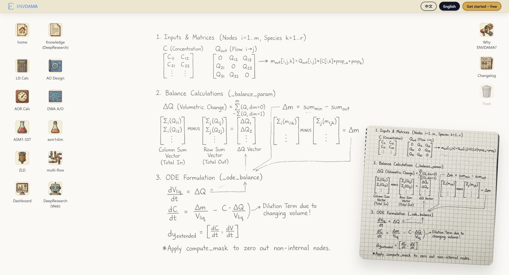
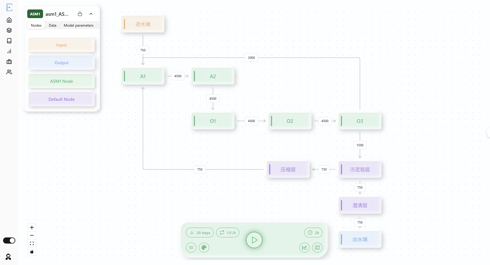
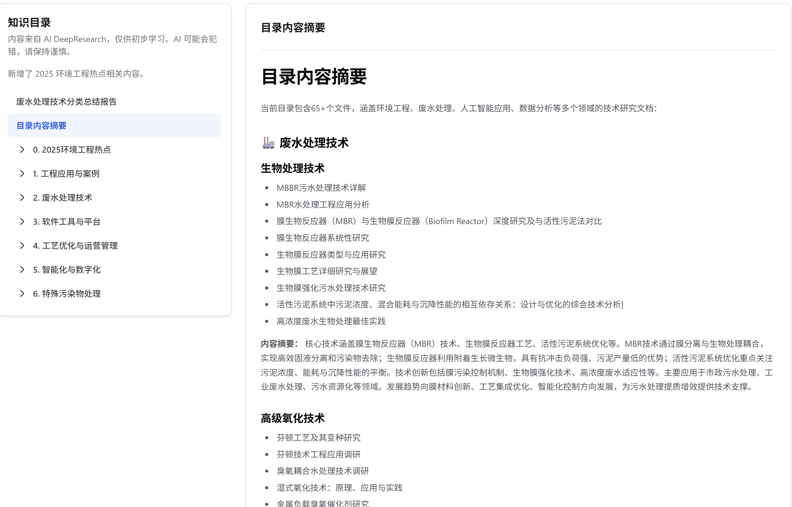
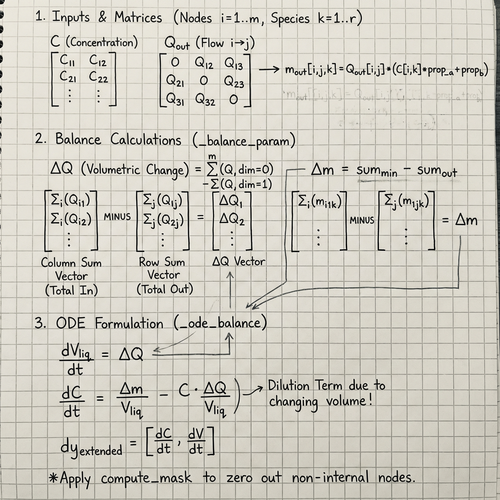

# AutoWaterSimu

AutoWaterSimu 是一个面向水处理/水循环工艺的全栈建模与仿真平台，支持流程搭建、参数配置、仿真运行与结果分析。

## 亮点功能

- 基于 `@xyflow/react`（React Flow）的工艺流程图建模
- ASM 系列模型相关的仿真工作流与结果查看
- 物料/质量衡算分析工具
- DeepResearch 知识库内容融入产品体验
- 内置国际化（中文 / English）

## 截图与示意图

### Landing Page


### 流程图新主题与模拟面板


### DeepResearch 知识库


### 后端核心逻辑（AI 生成的手绘推导式）
该图用于展示多池仿真模拟计算的核心实现逻辑（后端核心代码对应的推导思路）。



## 更新日志 / Changelog

- 产品内更新页：`/updates`
- MDX 源文件：
  - 英文：`frontend/src/data/updates/en/`
  - 中文：`frontend/src/data/updates/zh/`

## 本地开发

### 前端

```powershell
cd frontend; npm install; npm run dev
```

类型检查（前端改动后必做）：

```powershell
cd frontend; npx tsc --noEmit
```

### 后端（示例）

```powershell
cd backend; .venv\Scripts\activate; fastapi run app/main.py
```

## 部署提示（SPA 路由）

若使用 Nginx 部署前端，需为前端路由（例如 `/docs`、`/updates`）配置回退到 `index.html`：

```nginx
location / {
  try_files $uri /index.html;
}
```

## License

见 `LICENSE`。

