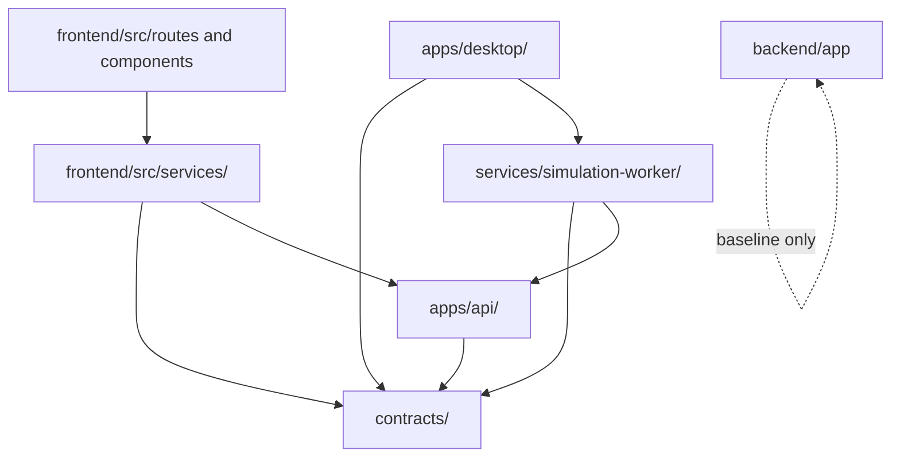

# AutoWaterSimu Next Dependency Graph

> Status: initial enforced boundary set, 2026-05-31.

## Intended Direction



## Enforced Rules

The repository-level dependency check is `scripts/check-deps.ps1`, exposed as `just check-deps`.

Current rules:

| Rule | Reason |
|---|---|
| `contracts/` must not depend on runtime modules such as `apps/api`, `apps/desktop`, `frontend/src`, `backend/app`, or `services/simulation-worker` | Contracts are the shared source of wire shape, not a runtime consumer |
| `apps/api/` must not import legacy `backend/app` | Go Compute API must stay independently deployable |
| `apps/api/internal/platform` must not import `apps/api/internal/compute` | Platform auth/config/http/metrics helpers must stay below compute domain packages and avoid reverse domain dependencies |
| `apps/api/internal/domain` must not import `apps/api/internal/compute` | Domain packages such as workers must stay independent from the compute compatibility wiring package |
| `apps/desktop/` must not import legacy `frontend/src` | Desktop runtime and UI are owned separately from legacy Web |
| `frontend/src/routes` and `frontend/src/components` must not import `frontend/src/client/compute` directly | Generated Compute client belongs behind service wrappers |
| `backend/app` must not depend on Next runtime modules | Legacy backend remains a migration baseline |

## Allowed Exceptions

- `frontend/src/services/computeJobsService.ts` may import `frontend/src/client/compute` and re-export stable UI-facing types.
- Documentation may reference paths across modules.
- Release gate scripts may orchestrate commands across modules but must not inline business logic.

## Validation

```powershell
powershell -NoProfile -ExecutionPolicy Bypass -File scripts\check-deps.ps1
```

The check is intentionally shallow. It is designed to catch obvious cross-layer imports early, not replace architectural review.
