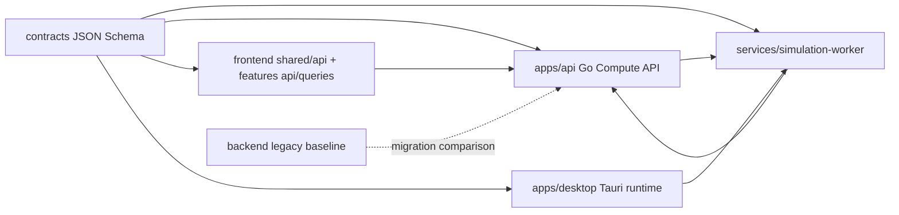

# AutoWaterSimu Next Module Map

> Status: current-state architecture entry, 2026-05-31.

AutoWaterSimu Next is developed as a monorepo-style evolution beside the legacy FastAPI and React baseline. The current target is a modular monolith and cross-runtime contract system, not a microservice split.

## Top-Level Modules

| Module | Responsibility | Primary interfaces | Verification |
|---|---|---|---|
| `contracts/` | JSON Schema contracts, examples, and schema fixture tests | `*.v1.json`, `examples/`, `contracts/tests` | `backend\.venv\Scripts\python -m pytest contracts\tests -q` |
| `apps/api/` | Go Compute API: jobs, workers, artifacts, model governance, evidence, simulation checks, OpenAPI | HTTP API, `openapi/compute.openapi.json` | `cd apps\api; go test ./...` |
| `services/simulation-worker/` | Python worker CLI, job execution, artifact output, API loop bridge | CLI, worker HTTP contract, JSON-RPC sidecar mode | worker self-check, worker pytest |
| `frontend/` | Legacy web app plus Next compute-oriented UI surfaces | Vite routes, services, generated legacy and compute clients | `cd frontend; npx tsc --noEmit` |
| `apps/desktop/` | Tauri Desktop runtime, local SQLite, sidecar orchestration, project packages | Tauri commands, SQLite, packaged worker, desktop packages | `npm run typecheck`, `cargo test` |
| `simulation_core/` | Pure Python simulation core extraction target | Python package/tests | `backend\.venv\Scripts\python -m pytest simulation_core\tests -q` |
| `backend/` | Legacy FastAPI baseline and migration comparison surface | FastAPI routes, SQLModel, legacy compute read-only guard | targeted backend pytest |
| `scripts/` | Repository-level verification and release gate orchestration | PowerShell scripts, evidence under `tmp/` | release gate script |

## Platform Flow

## Boundary Notes

- `contracts/` is the cross-runtime wire-shape source. Runtime modules can consume contracts; contracts must not import runtime modules.
- `apps/api/` owns HTTP lifecycle and metadata. It must not import legacy `backend/app`.
- `services/simulation-worker/` executes jobs through contracts and the Compute API bridge. It must not write PostgreSQL or legacy FastAPI internals directly.
- Compute routes call `frontend/src/features/*/queries.ts` for query/mutation options. Generated Compute client imports stay in `frontend/src/shared/api` and `frontend/src/features` wrappers, not in routes/components or the compatibility facade.
- `apps/desktop/` owns local runtime and worker lifecycle. It must not depend on legacy `frontend/`.
- `backend/` remains the legacy baseline and should not depend on Next runtime modules.

## Current Modularization State

The Go API still primarily lives under `apps/api/internal/compute`. This is accepted current state. The next structural step is to split domain and store interfaces after dependency checks and scenario-level tests are in place.
