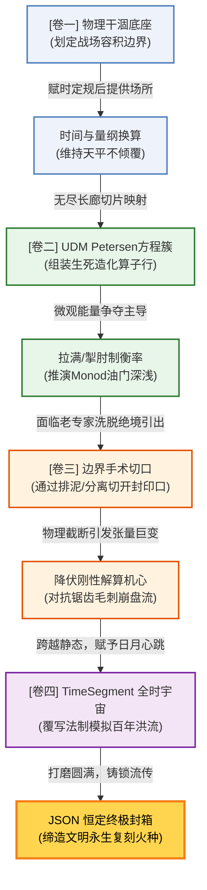

# AutoWaterSimu 实战通关教程：第 13 章 - 第 16 章

> **[📍 知识网络坐标：高阶动态与造物封装大圆满]**
> *前三卷我们雕琢完了系统的“空间”、“法则”与“截留规则”。但这只是一张不会动的静态拍立得。真实的工程世界，伴随着清晨的暴雨洪峰、傍晚的能耗波峰，以及隔壁同行要你交出“一键运行复现全厂”的标准验收考核单。在这里，我们将赋予沙盘真实流淌的时间心跳，并为这半生所学挂上封装结业的锁钥。*

---

## 第 13 章：敏感性分析与不确定性：让模型“可解释”

### 13.1 核心认知：你的参数对最终 KPI 到底有多重要？
在项目会上，专家指着一堆代码问：“如果在冬季进水温度骤降，你推演出的 $\mu_A$ 万一测不准，我们厂会不会因为这个参数崩溃？”
此时，你不能凭直觉拍胸脯说“大概不会”。你需要拿出**敏感性分析 (Sensitivity Analysis)** 数据：系统地让受疑参数在一定的**合理波幅**内抖动，观察它在这个模型生态内激起的“出水水质涟漪”。

* 💡 **【直觉类比：桥梁的抗风测振】**：
  敏感性分析就是在一座悬索桥上，用锤子分别去敲主钢缆、副锚点和护栏（扰动不同参数）。如果敲护栏断了，出水水质巍然不动（这叫参数钝感，随便填都不影响大局）；但如果用极小的力敲了一下主钢缆，整座桥开始产生毁灭性的共振荡崖（参数极度敏感），那这个参数就是你本期项目必须花重金去实地测准的阿喀琉斯之踵！

### 13.2 最小例题：给 3 个核心参数来一次压力“体检”
**任务**：选定硝化比生长速率 $\mu_A$、半饱和常数 $K_s$、回流分配系数 $R$，实施扰动压力测试。

🧠 **工程师脑内推演 (Think-Aloud)**：
> “做敏感性测试，最致命的问题是：『扰动幅度到底选多大？』
> 新手喜欢一律上下加减 15% 或者翻倍。错！参数的敏感测试底线在于符合事物客观物理可抵达边界。
> 比如水温，冬天波动 5℃（这是绝对值加减）；比如回流泵功率，可能因为电网老化波动 10%（这是比例加减）。如果你把细菌最大浓度强拉 400% 到果冻的黏度来算极值，那就是伪科学暴走！
> 我现在定规：根据文献该水厂的 $\mu_A$ 最不确定度在 +/- 15%，我就严格以此为标尺去扰动。”

**操作步骤**：
1. **基准靶位采集**：跑一次默认标定，记录系统稳态末端的追踪因子 $NH_4$（例如 3.5 mg/L）。
2. **单因子严控扰动**：每次仅将上述 3 个选项中的**一个**拉高或压低设定界线，记录引发的新的稳态出界偏离值 $\Delta NH_4$。
3. **输出工程定论报告**：揭晓龙卷风对比图。若某参数稍微摇晃就导致出水指标冲天毁约超标，它即是重点监控靶图。

### 13.3 工程师诊断题：敏感性分析报告结果完全反向虚假失真了？
**场景**：你在报告里信誓旦旦写明：模型中温度修正因子对出水的波及影响为 $0$。现实一入冬，出水随降温曲线起伏暴崩。
**排故思路**：常数影响真的是 0 吗？最大概率是 —— 你的观测截屏采集时机，连稳态的地平线都还没越过。
* ❌ **反例深渊（截错了时光的切片）**：
  查一下你在 `CalculationParameters` 中配置仿真推进时长 `hours` 的总长度！在泥水大回流系统里（动辄 HRT=10天、SRT=20天），系统惯性极大。你修改了源头温度，产生的微小裂痕震荡波，需要极其漫长的水力漂流发酵才能传导到几千立方米外的出水口探头上。你在这之前仅仅跑了区区 1 天就“强行收网”取样，宣称前端参数“钝感无足轻重”。这是彻头彻尾的时间量纲倒错错案。

---

## 第 14 章：自定义模型 (UDM) 工作流：从矩阵到前台面板

### 14.1 核心认知：你是如何通过改代码“无中生有”创造软件滑块的
AutoWaterSimu 并非一个“闭门参数定死”的僵硬软件。它拥有一颗能动态解析文本并反推 UI 层的强劲心脏。
* 💡 **【直觉类比：游戏里写 MOD (模组)】**：
  就如同你不用去懂游戏底层 C++ 直接通过修改几行配置文件，游戏里就凭空多扫出了一把光剑供玩家挥舞。当你为节点修改加入了全新的公式字符，系统底座会自动解析出这个词，将它提炼包装成 `Flow Inspector (属性板)` 上顺滑漂亮可拉拽的输入栏组件。你直接升维成了给软件写拓展插件的“局外造物神”。

### 14.2 最小例题：注入一段高级“二次抑制特性”并即刻接管它
**任务**：在传统的硝化降解动力学文本框里，手敲混入一段重金属毒杀的数学表达式。

🧠 **工程师脑内推演 (Think-Aloud)**：
> “原有的速率公式太平庸了，甲方说厂里有时会混入高浓度氯离子冲击减缓反应。我要怎么加进系统？
> 这其实很简单：在动力学 (Rate) 框末尾，我直接粗暴地用 `*` 号挂上一条数学上的抑制概率滤网 `(K_tol / (K_tol + Cl_ion))`！
> 这里面的 $K_{tol}$ (氯离子耐受度)，是我随脑编印出的新系统全局游离字符！我要看引擎能不能接住它并开放给我填数。”

**操作步骤**：
1. **加入毒杀滤片**：在选中节点的反应 Rate 配置文本框尾部，键入我们推演的定制代码。
2. **挂载提交给神（保存）**：点击应用修改让后台去解析这满是新词汇的黑天鹅公式。
3. **查验 UI 即时响应回馈**：震撼显现。系统非但没有报错崩溃，反而智能地识别抽取出 `K_tol`，并即刻把它化作该节点右侧属性卡片里一段优雅可展开配极值的浮窗操作悬浮栏！

### 14.3 常见错因库索引
* ❌ **未定义的游离野字符幽灵**：把定义好的主状态 $S\_{NH4}$ 手抖敲成了 $S\_{nh4}$，直接触发底层解释引擎撞墙宕机死锁报错卡死。严格遵守大小写强对应！
* ❌ **越界极值初生荒诞**：系统给你配成了滑块后，你在 Inspector 去配 `[Min, Max]` 极值，手速过快配成了 `[10, -50]` 这样上下反转或踏入负域雷区的框体。微分步法探测碰壁发出灾变解算白屏。

---

## 第 15 章：时间序列覆写：系统接轨真实宇宙的时段脉动

### 15.1 核心认知：水厂是一场交响乐，不是死平调
若没学这章，你的水厂从早到晚进水管道都是僵化的一个定数。真实世界里有早晚做饭高峰、半夜清空洗管谷底。在最高阶仿真中，我们使用 **TimeSegment (多时段控制器)** 在引擎层面划定时间切片，对连线实施降维打击式参数接管（`edge_overrides`）。

* 💡 **【直觉类比：音乐软件的多轨混音块】**：
  `TimeSegment` 就是编曲软件下面那一条条跨时间的色块音轨。
  前 0-8 小时拉定一个色块，叫“晨间小调”（原默认参数平滑推移）；8-12 小时排布一个狂暴红色块，叫“洪峰重金属”（强行写入 Edge 重载覆写极高速率通量）。你的模拟池，就在时光机推盘前进跨越这段色块的一瞬间，被这些被强植入的极端新参数爆压震荡而起，演奏出如真实心电般起伏宏大的交响厂区波形谱！

### 15.2 最小例题：安排一座历经“晚高峰冲浪”的悬浮反应大缸
**任务**：利用 TimeSegments 为系统凭空制造一场持续 4 小时的三倍暴雨水力进流冲刷！

🧠 **工程师脑内推演 (Think-Aloud)**：
> “我要想看到池子被冲爆的极效波澜，该去改谁？去改 UDMNode 里面的反应常数 $\mu$ 吗？
> 错！这是很多高手的滑铁卢。暴雨属于『外部物理边界载荷突变』。因此必须使用 TimeSegment 去精准靶击瞄准绑死并覆写那根**『最源头的进水连线 (Edge Flow Rate)』**。
> 用 3 倍粗暴的新极值替换它，静候后续在生化图谱端结出的那场海啸波段结晶！”

**操作步骤**：
1. **呼出时轴上帝控制台**：在全局面板开启 `TimeSegments`，切分添加两段刻度。
2. **划定时区分野**：首段 `calm_hours` 坐标 0$\rightarrow$8；次段 `rain_storm` 坐标 8$\rightarrow$12。
3. **刻下越级覆写符咒 (Overrides)**：选中代表进水那条连线的源 Edge，在 `rain_storm` 时段子切片里，录入高达 3 倍以上的破表流量重载覆盖参数！
> **[🎥 视频录制提示：播放运行动画。底轴时间线平缓划过了 7 小时、7.5 小时...当跨过 8.0 小时红线的那一刹那刻，原本平滑呆板的水质波曲线像被超大功率起搏电击了一般，直挺挺朝右上角以不可思议的高抛弧度撕裂陡升上跃扬出！完美的厂区洪流逼真沙盘！]**

---

## 第 16 章：交付与复用大结局：从手搓到一键封箱部署

### 16.1 核心认知：只能跑一次的模型，只配称电子废纸
项目最痛的是过了半年甲方复议审计。你翻遍磁盘看到几十个没命名的 UDM 版本，你死活记不起当初连线上的极值你挂的是 0.5 还是 0.55 才跑出那条完美紧贴的出水校验线的。
我们需要通过系统 `JSON` 流将图谱定态底片、初始驻底浓度 ($Initial Concentrations$) 等**悉数一键封印打包入盒**，打造为无需前置依赖便可随地分发部署的工业资产实体包裹。

🧠 **工程师脑内推演 (Think-Aloud)**：
> “把一个项目交给后人，不是给他几个代码文件就算完。
> 我们要封存下的是一个『带有着准确昨日水库淤泥残压（开局初始浓度）』和『精确管网流速刻表』的全景世界切片。
> 当对方用 JSON 唤醒这套标兵模型时，它是继承了所有岁月荣泽并处于高度战备待爆破的准就各位原点态。只需一点 Run，必须跑出和我当年熬夜调平后分毫无差的完美复现线。”

### 16.2 封箱入库与最终章技能盘点
系统提供了一键抽取所有画布元素与内置属性为统一大 `JSON` 数据结构，将你千锤百炼打出的所有滑边常数铁证化沉淀入字典中，这标志着你将水务工艺抽象成了数字时代流通的加密基石！

---
## 【终局彩蛋】：AutoWaterSimu 建模大师技能树 (Knowledge Network)

至此你已随指引走完四卷十六宗天道历练。回头审视，这不是一盘散沙的模块孤岛，此乃一座拔地接天、彼此嵌套互融且层层递进升维不可割裂的造物城池。请在脑海刻下这张图谱，随时点亮对应支脉斩破日后所有水务工程沉疴迷雾！

**（全教程 最终圆满完结）**
